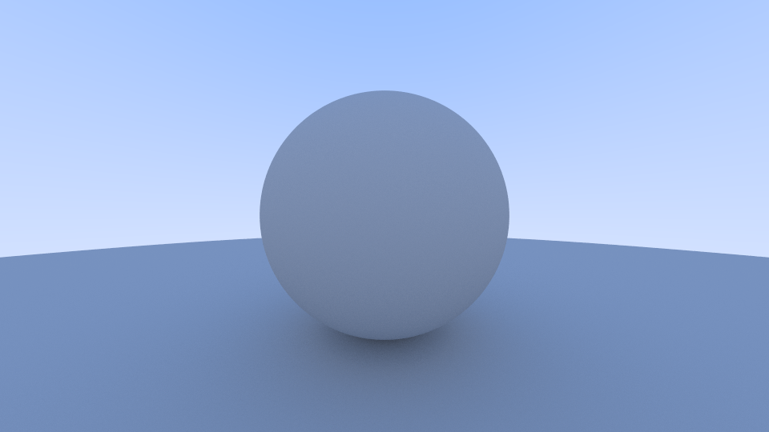

# Luma

This is a simple ray tracer which uses [Ray Tracing in One Weekend](https://raytracing.github.io/books/RayTracingInOneWeekend.html) as a starting point. This code has (many) more comments than the code on that site, so I hope you can learn from it as well.

Confession time: I am using this as a way to (finally!) write a ray tracer from scratch. I have modified ray tracers, integrated ray tracers, and used ray tracing frameworks (like DirectX Raytracing), but somehow never wrote a ray tracer from scratch, not even in school.

This is written as a Visual Studio 2019 project. Just open the solution file, and build the Debug or Release configuration. The Release configuration is _much_ faster here.

Currently the code covers up to and including section 8 of _Ray Tracing in One Weekend_, "Diffuse Materials." It will render the image below (or one close to it, depending on settings).

_Rendered at 960x540 with 256 samples per pixel in 15 seconds on a Core i7-8700 CPU with 12 threads._
